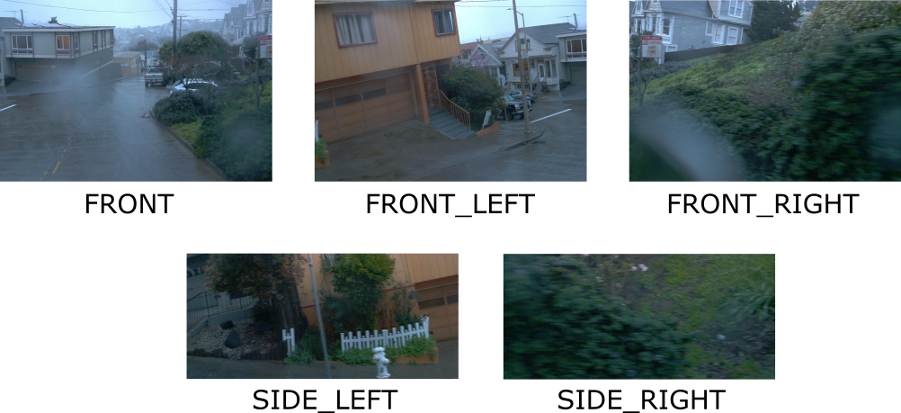

# Waymo Open Dataset Toolkit

## Description
A set of functions to extract and visualize Waymo Open Dataset. 

## Features
- Extract images per frame per segment with corresponding labels
- Extract images per camera with corresponding labels
- Extracted images are stored as png
- Extracted labels are in the format: object-class x y width height
- Extract LiDAR data as point clouds with camera projections
- Visualize LiDAR data as point cloud

## Screenshots

### Camera Data

### Video

### Point Cloud Data

## Requirements
Linux, Python, Waymo Open Dataset, OpenCV, Open3D

## Usage
Repo consists short code implemented in [src/main.py](src/main.py) to demo data extraction process, video creation, object count consolidation and [src/visualize.py](src/visualize.py) to visualize camera and LiDAR data. 
Make sure you have `gsutil` set up correctly on your machine before trying to retrieve data. 

## License
Licensed under [GNU AGPL v3](https://github.com/KushalBKusram/WaymoDataToolkit/blob/master/LICENSE).

 
